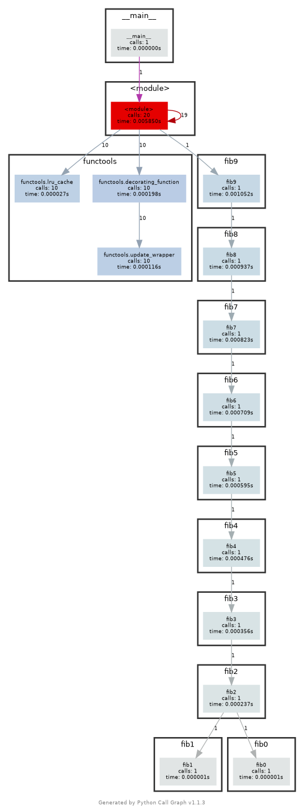
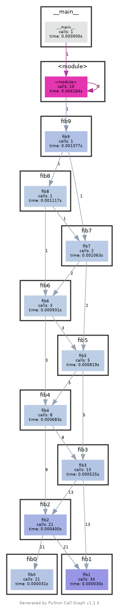

# Profiling

## Exercise 5

Output of line-profiler:
```Shell
Wrote profile results to sorts.py.lprof
Timer unit: 1e-06 s

Total time: 0.087952 s
File: sorts.py
Function: insertionsort at line 9

Line #      Hits         Time  Per Hit   % Time  Line Contents
==============================================================
     9                                           @profile
    10                                           def insertionsort(array):
    11                                           
    12     26524       3194.3      0.1      3.6      for i in range(len(array)):
    13     25524       2801.6      0.1      3.2          j = i-1
    14     25524       2546.1      0.1      2.9          v = array[i]
    15    235790      30550.3      0.1     34.7          while j >= 0 and v < array[j]:
    16    210266      25459.3      0.1     28.9              array[j+1] = array[j]
    17    210266      20120.5      0.1     22.9              j -= 1
    18     25524       3023.2      0.1      3.4          array[j+1] = v
    19      1000        256.5      0.3      0.3      return array

Total time: 0.0623559 s
File: sorts.py
Function: quicksort at line 21

Line #      Hits         Time  Per Hit   % Time  Line Contents
==============================================================
    21                                           @profile
    22                                           def quicksort(array):
    23     35240       4818.9      0.1      7.7      if len(array) <= 1:
    24     18120       2509.6      0.1      4.0          return array
    25     17120       1886.0      0.1      3.0      pivot = array[0]
    26    130740      21443.3      0.2     34.4      left = [i for i in array[1:] if i < pivot]
    27    130740      21499.3      0.2     34.5      right = [i for i in array[1:] if i >= pivot]
    28     17120      10198.7      0.6     16.4      return quicksort(left) + [pivot] + quicksort(right)

Total time: 0.0808001 s
File: sorts.py
Function: quicksort_inplace at line 30

Line #      Hits         Time  Per Hit   % Time  Line Contents
==============================================================
    30                                           @profile
    31                                           def quicksort_inplace(array, low=0, high=None):
    32     32460       4314.0      0.1      5.3      if len(array) <= 1:
    33        53          7.5      0.1      0.0          return array
    34     32407       3983.1      0.1      4.9      if high is None:
    35       947        144.7      0.2      0.2          high = len(array)-1
    36     32407       3960.9      0.1      4.9      if low >= high:
    37     16677       2576.2      0.2      3.2          return array
    38                                           
    39     15730       1714.4      0.1      2.1      pivot = array[high]
    40     15730       1873.8      0.1      2.3      j = low-1
    41    117949      14571.5      0.1     18.0      for i in range(low, high):
    42    102219      11532.5      0.1     14.3          if array[i] <= pivot:
    43     52446       5990.4      0.1      7.4              j += 1
    44     52446       6632.3      0.1      8.2              array[i], array[j] = array[j], array[i]
    45     15730       2205.7      0.1      2.7      array[high], array[j+1] = array[j+1], array[high]
    46     15730       8841.2      0.6     10.9      quicksort_inplace(array, low, j)
    47     15730       8350.0      0.5     10.3      quicksort_inplace(array, j+2, high)
    48     15730       4101.7      0.3      5.1      return array

```

## Exercise 6

The difference is with or without using the cache:  




